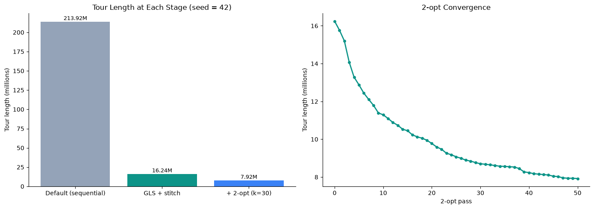

# Large-Scale TSP via Clustering and Meta-Heuristic Optimization

A two-level heuristic solver for a **115,475-city** Traveling Salesman Problem, built in Python with NumPy and SciPy. The cities are split into 1,000 clusters, each cluster is solved separately, and the pieces are stitched back into one tour and cleaned up with 2-opt.

**Result:** a final tour of **7,924,262**, **96.3% shorter** than the 213.9M sequential baseline, in about 24 minutes on a laptop (seed = 42, reproducible).



## Problem

Given $n$ cities with distances $d(c_i, c_j)$, find the visiting order $\pi$ that minimizes total tour length:

$$\min_{\pi} \sum_{i=1}^{n} d\big(c_{\pi(i)},\, c_{\pi(i+1)}\big), \qquad \pi(n+1) = \pi(1)$$

TSP is NP-hard. At $n = 115{,}475$, even a full distance matrix is out of reach: about $1.3 \times 10^{10}$ entries, or roughly 100 GB. The solver therefore only builds distance matrices inside each cluster (about 115 cities each).

## Pipeline

| Step | Method | What it does |
|---|---|---|
| 1 | **k-means++** ($k = 1000$) | Splits the cities into 1,000 geographic clusters |
| 2 | **Guided Local Search** | Solves each cluster, starting from a nearest-neighbor tour |
| 3 | **Simulated annealing on centroids** | Chooses the order in which to visit the clusters |
| 4 | **Greedy stitch** | Rotates each sub-tour to start at the city closest to the previous cluster, then joins them |
| 5 | **Candidate-list 2-opt** | Removes crossing edges across the whole tour, especially at the seams |

Ant Colony Optimization (ACO) is implemented as an alternative to GLS for step 2 and compared per cluster.

## Results (seed = 42)

| Stage | Tour length | vs. baseline |
|---|---|---|
| Sequential baseline (cities in file order) | 213,920,969 | — |
| k-means + GLS + stitch | 16,241,548 | 92.4% shorter |
| + candidate-list 2-opt (k = 30, 50 passes) | **7,924,262** | **96.3% shorter** |

- **2-opt cut the stitched tour by 51.2%.** The stitch was the weakest step, and the convergence plot shows 2-opt was still improving slowly when it hit the 50-pass limit.
- **k-means** loss (within-cluster sum of squares) fell 16.5% from iteration 1 to iteration 5 ($1.43 \times 10^{10} \to 1.19 \times 10^{10}$).

**Runtime (serial, one core):**

| Step | Time |
|---|---|
| k-means | 15.6 s |
| GLS on 1,000 clusters | 933.2 s (0.93 s per cluster) |
| Cluster ordering | 26.1 s |
| 2-opt | 446.6 s |
| **Total** | **≈ 24 min** |

## Per-cluster benchmark

The notebook's Section 10b compares the three solvers on the 10 clusters closest to the median size (112–113 cities), using SA with 5,000 iterations, GLS with 15 rounds × 500 moves, and ACO with 4 ants × 10 iterations.

| Solver | Avg. tour length | Avg. time per cluster | vs. SA |
|---|---|---|---|
| Simulated annealing (baseline) | 18,917 | 1.00 s | — |
| **Guided Local Search** | **7,653** | **0.03 s** | **59.5% shorter** |
| Ant Colony Optimization | 8,235 | 0.04 s | 56.5% shorter |

- **GLS gave the shortest tour on 9 of 10 clusters**, and ACO's tours were 7.6% longer on average.
- **GLS was also the fastest,** about 30x faster than SA. Timings are rounded to 0.01 s, so the GLS-vs-ACO speed ratio is approximate.
- This is why the full pipeline uses GLS for step 2.

## Algorithms

### Guided Local Search (GLS)

GLS escapes local optima by adding penalties to edges that keep showing up in the tour:

$$h(s) = g(s) + \lambda \sum_{e \in s} p_e$$

Here $g(s)$ is the true tour length and $p_e$ is the penalty on edge $e$. Each round tries random city swaps and single-city moves (Or-opt), then penalizes the tour edge with the highest utility:

$$u_e = \frac{d_e}{1 + p_e}$$

**Constant-time move evaluation.** A swap only changes the edges around the two cities being swapped, so its cost difference is computed from at most 4 old and 4 new edges using the cluster's distance matrix. Recomputing the whole tour would take $O(n)$ time per move instead of $O(1)$.

### Ant Colony Optimization (ACO)

Ants build tours step by step, choosing the next city with probability

$$p_{ij} = \frac{\tau_{ij}^{\alpha}\, \eta_{ij}^{\beta}}{\sum_{l \in \text{unvisited}} \tau_{il}^{\alpha}\, \eta_{il}^{\beta}}, \qquad \eta_{ij} = \frac{1}{d_{ij}}$$

After each iteration, pheromone evaporates and is reinforced along the tours just built:

$$\tau_{ij} \leftarrow (1 - \rho)\,\tau_{ij} + \sum_{\text{ants}} \frac{Q}{L_{\text{ant}}}$$

Settings: $\alpha = 1$, $\beta = 3$, $\rho = 0.1$, $Q = 1$.

### Candidate-list 2-opt

A 2-opt move removes edges $(a, b)$ and $(c, d)$ and reconnects them as $(a, c)$ and $(b, d)$, reversing the segment between them. The gain is

$$\Delta = d(a,b) + d(c,d) - d(a,c) - d(b,d)$$

Checking every pair is $O(n^2)$ per pass, which is too slow at this size. Instead, each city only tries its 30 nearest neighbors (found with a k-d tree), so a pass costs $O(n \cdot k)$.

## How to run

```bash
pip install -r requirements.txt
# put cities.csv (format: index longitude latitude) next to the notebook
jupyter notebook TSP_Project.ipynb   # then Run All
```

The pipeline seeds NumPy once (`SEED = 42`), so rerunning gives the same tour. The final tour is saved to `full_tour_gls_seed42.npy`.

## Limitations and next steps

- **The pipeline runs on one core.** The 1,000 clusters are independent, so running them in parallel (`multiprocessing`) or compiling the inner loops (Numba) would cut the 15-minute GLS step substantially.
- **2-opt had not fully converged** at 50 passes. More passes, or Or-opt moves on the full tour, should shorten it further.
- **The stitch only optimizes where each sub-tour starts**, not where it ends, so the seams are the main source of excess length.
- **Results come from one seed.** Running several seeds would show how much the final length varies.

## Credits

Built with Geno as a final project for an optimization course (2026). The simulated annealing baseline was provided by the course instructor.
